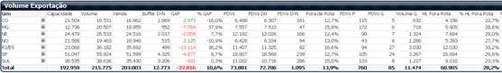

# Teste de Business Intelligence
Teste de conhecimentos em Business Intelligence realizado pela Mouts.

## Requisitos do Teste

Recriar a tabela abaixo, com seus KPIS de acordo com as regras
indicadas:

1. Criar opção de filtro para GEO, NomeCDD e CodFilial
2. Capacidade: Soma da capacidade (volume) do arquivo capacidade.csv
3. Volume: Soma do campo “Marc” do arquivo CDP. Quando o campo CodMotivo for igual a 0, 6, 7.
4. Venda: Soma do campo “Marc” do arquivo CDP. Quando o campo CodMotivo for igual a 0,6,7 e o campo Idade do Pedido for igual a 0 (zero).
5. Buffer D-N Soma do campo “Marc” do arquivo CDP. Quando o campo CodMotivo for igual a 0,6,7 e o campo Idade do Pedido for maior que 0 (zero).
6. GAP: A diferença entre os KPIs “Capacidade” e “Volume”. Em caso negativo, o texto deverá ficar vermelho
7. % GAP: Calculo percentual entre os KPIS “Capacidade” e “Volume”. Em caso negativo, o texto deverá ficar em vermelho.
8. PDVs: Count distinct do campo “Chave Cliente”. CodMotivo igual a 0,6,7, Idade do Pedido=0, Idade do Pedido&gt;0*
9. PDVs 0: Count distinct do campo “Chave Cliente”. CodMotivo igual a 0,6,7, Idade do Pedido=0
10. PDVs D-N: Count distinct do campo “Chave Cliente”. CodMotivo igual a 0,6,7
Idade do Pedido&gt;0
11. Fora de Rota: Count distinct do campo “Chave Cliente” onde o campo “Fora de Rota” = Sim e CodMotivo = 0,6,7 / Count distinct do campo “Chave Cliente” onde o campo CodMotivo = 0,6,7
12. PDV P: Count distinct “Chave Cliente”
Regra: CodMotivo = 0,6,7 e Marc &lt; 0,01
13. PDV G: Count distinct “Chave Cliente”. CodMotivo = 0,6,7 e Marc &gt; 50
14. Volume G: Soma do campo “Marc”. CodMotivo = 0,6,7 e Marc &gt; 50
15. HL Fora de Rota: Soma do campo “Marc”. CodMotivo = 0,6,7 e Fora de Rota”=Sim
16. Criar 2 tabelas (top e bottom) com a dimensão NomeCDD considerando a métrica “% GAP”.
17. Criar gráfico por GEO, demonstrando as métricas Volume, Capacidade e percentual.
18. Criar filtros para GEO e CDD, permitindo que sejam visíveis/ocultados a critério do usuário.

Demais KPIs da imagem não são necessários.